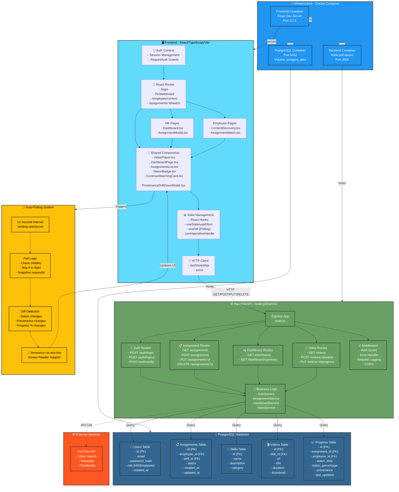

# TalentPilot-AI System Architecture

## Architecture Components

### 🖥️ Frontend Layer (React/TypeScript)

**Routing & Authentication:**
- `AuthContext` - Manages user session and role-based access
- `RequireAuth` - Guards protected routes
- React Router - Handles navigation between pages

**Pages:**
- **HR Routes**: Dashboard for skill assignments, create/manage assignments
- **Employee Routes**: Content discovery, video watching, progress tracking

**Components:**
- `DashboardPage` - Main HR interface with auto-polling, grouped by employee
- `VideoPlayer` - Embedded video playback with controls
- `ProvenanceDrillDownModal` - HR can view and override assignment status
- `StatusBadge` - Visual status indicators (Not Started, In Progress, Completed)
- `ContinueWatchingCard` - Resume from where employee left off

**State Management:**
- React Hooks for local state
- `useRef` for polling interval and in-flight tracking
- `useImperativeHandle` for exposing dashboard refresh method
- Toast notifications for user feedback

### ⚙️ Backend Layer (Node.js/Express)

**Route Modules:**
- **Auth Routes** - Login, logout, session verification
- **Assignment Routes** - CRUD operations for skill assignments
- **Dashboard Routes** - Aggregated assignment data for HR view
- **Video Routes** - Video metadata, watch tracking, progress updates

**Services:**
- Business logic layer handling validation and data operations
- Calls repositories to interact with database

**Middleware:**
- Authentication guard for protected endpoints
- Global error handler
- Request logging
- CORS configuration

### 💾 Database Layer (PostgreSQL)

**Tables:**
- **Users** - Employee and HR accounts with roles
- **Assignments** - Skill assignments linking employees to skills
- **Skills** - Available training skills/competencies
- **Videos** - Training video metadata and URLs
- **Progress** - Tracks employee progress on assignments (watch time, completion %, provenance)

### 🔄 Auto-Polling System

**Features:**
- 12-second polling interval while dashboard is visible
- Detects changes in: status, provenance, completion percentage
- Uses `requestId` to prevent race conditions from slow responses
- Announces changes via aria-live region for screen reader accessibility
- Pauses when browser tab is hidden (visibility API)

### 🚀 Infrastructure (Docker Compose)

**Services:**
- **Frontend Container** - React dev server on port 5173
- **Backend Container** - Node.js/Express API on port 3000
- **PostgreSQL Container** - Database on port 5432 with persistent volume

## Data Flow

1. **Authentication**: User → Frontend → Backend → Database (session created)
2. **View Dashboard**: Frontend polls → Backend aggregates → Database queries
3. **Create Assignment**: HR form → Backend CRUD → Database + toast notification
4. **Auto-Update**: 12s polling → Diff detection → aria-live announcement → UI refresh
5. **Watch Video**: Employee → Video player → Backend tracks progress → Database update
6. **Progress Tracking**: Video metadata → Progress calculation → Status update
