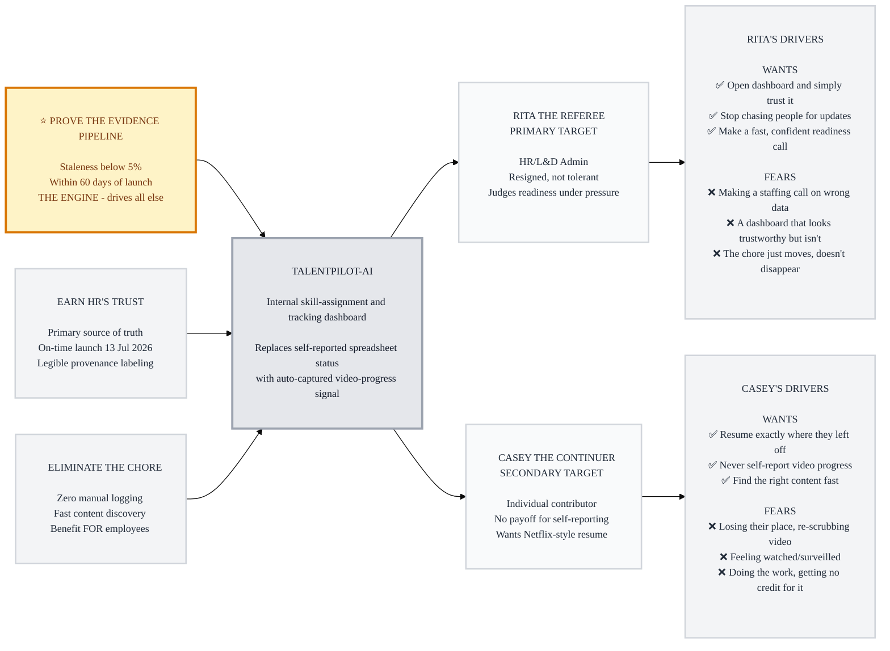

# Trigger Map: TalentPilot-AI

> Visual overview connecting business goals to user psychology

**Created:** 2026-07-08
**Author:** TalentPilot
**Methodology:** Based on Effect Mapping (Balic & Domingues), adapted for WDS framework — negative driving forces given equal weight to positive ones

---

## Strategic Documents

This is the visual overview. For detailed documentation, see:

- **[01-Business-Goals.md](01-Business-Goals.md)** - Full vision statement and SMART objectives
- **[02-Rita-the-Referee.md](02-Rita-the-Referee.md)** - Primary persona (HR Admin) with complete driving forces
- **[03-Casey-the-Continuer.md](03-Casey-the-Continuer.md)** - Secondary persona (Employee) with complete driving forces
- **[05-Key-Insights.md](05-Key-Insights.md)** - Design implications and strategic focus
- **[06-Feature-Impact.md](06-Feature-Impact.md)** - Prioritized features with impact scores

---

## Vision

Replace SAILS HR's spreadsheet-dependent skill tracking with a dashboard built on automatically-captured signal, not self-reported status — so HR can open it and simply trust what it says, without chasing anyone for an update.

---

## The Transformation

**Rita the Referee** stops compensating daily for data she doesn't trust and starts making fast, confident readiness calls — because **Casey the Continuer**'s honest engagement generates a verified signal automatically, as a byproduct of a resume experience Casey would want anyway.

## The Flywheel

1. ⭐ **Prove the evidence pipeline** — auto-captured video watch-% must outperform self-reporting (staleness below 5% within 60 days). THE ENGINE — nothing else matters if this doesn't hold.
2. 🚀 **Earn Rita's trust** — driven by the pipeline working: on-time launch, legible provenance labeling, Rita adopting TalentPilot-AI as her primary source of truth.
3. 🌟 **Eliminate Casey's chore** — a real-world benefit for Casey, not a company metric: zero manual logging, fast content discovery, Netflix/Spotify-style resume.

**Key Transformation:** One signal, two payoffs — the same video watch-position write that lets Casey resume exactly where they left off is the same write that updates Rita's dashboard as verified, timestamped progress. No separate sync step, no reporting chore, no drift between tracking and resume.

---

## Trigger Map Visualization

---

## Detailed Documentation

### Business Strategy — [01-Business-Goals.md](01-Business-Goals.md)

- **Vision:** A dashboard HR can open and simply trust, without chasing anyone
- **Primary Goal (THE ENGINE):** Prove auto-captured evidence outperforms self-reporting — staleness below 5% within 60 days
- **Secondary:** Earn HR's trust as the primary source of truth, launched on the 13 July 2026 hard deadline
- **Tertiary:** Eliminate the self-report chore as a direct benefit for employees

### Target Users

**[02-Rita-the-Referee.md](02-Rita-the-Referee.md) — Primary 👥**
> Resigned, not tolerant, about a spreadsheet process that forces her to independently verify data before she can act on it. Wants to open a dashboard and simply trust what it says.

**[03-Casey-the-Continuer.md](03-Casey-the-Continuer.md) — Secondary 💼**
> Self-reports into a shared sheet today with zero personal payoff. Wants a Netflix/Spotify-style resume experience — and gets one for free, as a byproduct of the same signal that solves Rita's trust problem.

### Strategic Implications — [05-Key-Insights.md](05-Key-Insights.md)

- Provenance must always be labeled in text, never color-only
- "Needs Attention" must be a first-class view, not an afterthought
- Casey's experience must stay invisible and frictionless to keep the signal honest
- A blank or "Unknown" cell beats a guessed one, at every layer

### Feature Priorities — [06-Feature-Impact.md](06-Feature-Impact.md)

- **Must Have MVP:** Auto-Captured Video Tracking, AI Content Discovery, HR Assignment Flow, Continue-Watching/Resume, Provenance-Labeled Dashboard, Needs-Attention Filter
- **Consider:** Proxy-signal tracking for docs/websites, HR "Assessed Live" audit-trail flag
- **Defer:** Weekly learning recap for employees

---

## How to Read This Map

- **Left to right:** Business goals feed into the product, which serves target groups, which have specific driving forces
- **Top to bottom priority:** The gold-highlighted goal (⭐) is THE ENGINE — everything else depends on it succeeding
- **✅ / ❌ symbols:** Positive drivers (wants/desires) pull users forward; negative drivers (fears/frustrations) push them away from the status quo — both are given equal design weight, because loss aversion often triggers action faster than desire alone
- **Persona priority:** 👥 marks the primary target (Rita); 💼 marks the secondary target (Casey) — Rita's behavior is the pilot's literal success metric, so she receives the most design attention

---

_Generated with Whiteport Design Studio framework_
_Trigger Mapping methodology credits: Effect Mapping by Mijo Balic & Ingrid Domingues (inUse), adapted with negative driving forces_
