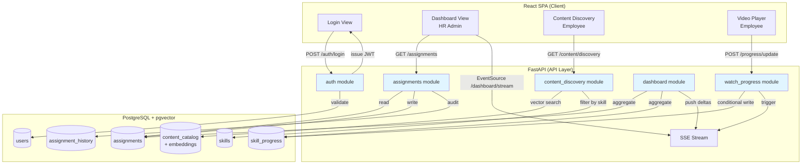
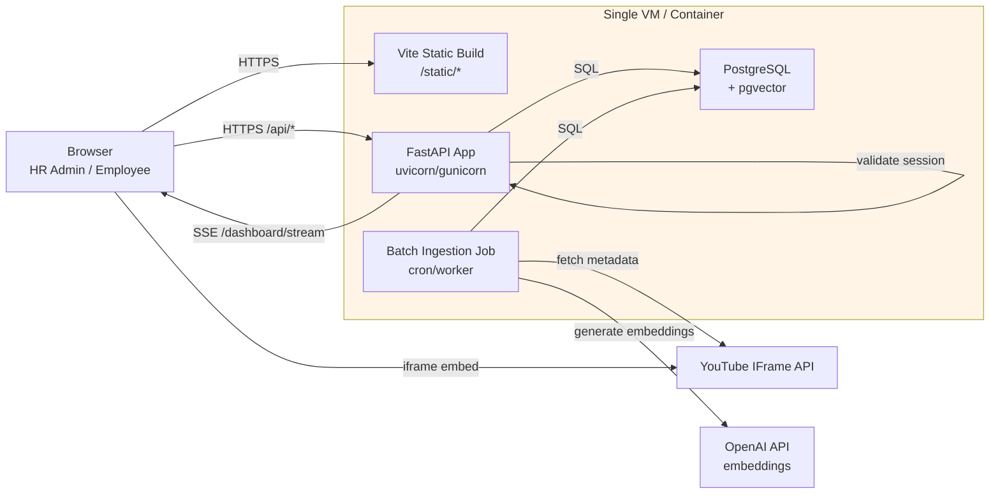
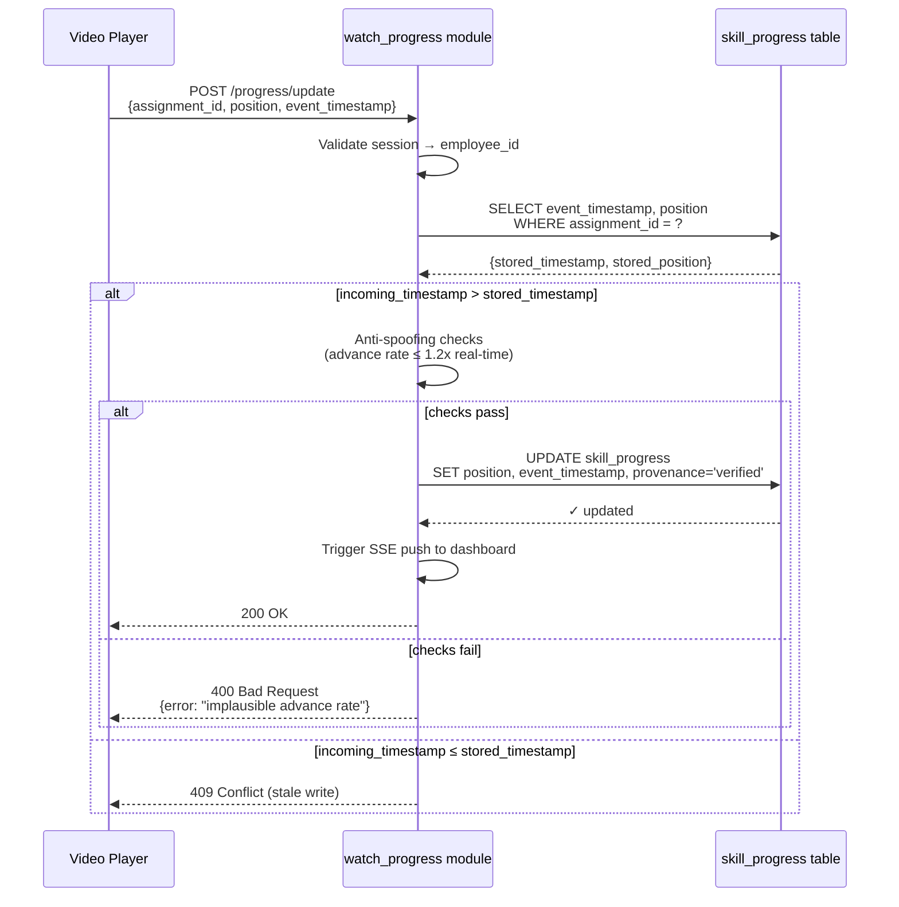

# Architecture Spine: TalentPilot-AI

## Paradigm

**Three-Tier Web Application with CQRS-lite separation**

Client SPA (React) → API layer (FastAPI) → Database (PostgreSQL). Read paths optimized separately from write paths to support conditional writes for watch-progress anti-spoofing and real-time dashboard updates via server-push.

## Architecture Decisions

### AD-1: Three-Tier Web with CQRS-lite
**Binds:** System-wide communication pattern  
**Prevents:** Mixing read-optimization with write-integrity constraints  
**Rule:** Client (React SPA) → API (FastAPI) → Database (PostgreSQL). Read paths (dashboard aggregation, content discovery queries) optimized separately from write paths (watch-progress conditional updates, assignment mutations). No shared mutable state between tiers—state flows unidirectionally through API contracts.

### AD-2: Domain-Driven Module Boundaries
**Binds:** Code organization, team ownership, independent deployability  
**Prevents:** Tangled dependencies, shared mutable state across features  
**Rule:** Five domain modules with clear ownership:
- `auth` — Session/JWT management
- `assignments` — HR workflow (create, list, override)
- `content_discovery` — RAG/vector search, content matching
- `watch_progress` — Video position capture, resume logic
- `dashboard` — Aggregation, real-time updates, provenance computation

Each module owns its database tables, service logic, and API routes. Cross-module communication only via service interfaces, never direct table access.

### AD-3: Data Ownership per Module
**Binds:** Database table→module assignment, mutation authority  
**Prevents:** Conflicting writes, ambiguous source-of-truth  
**Rule:**
- `assignments` owns `assignments` table (Employee×Skill linkage, status, hr_override flag)
- `watch_progress` owns `skill_progress` table (video position, event timestamp, provenance)
- `content_discovery` owns `content_catalog` table (embeddings, metadata)
- `auth` owns `users` table (credentials, roles)
- `dashboard` reads from all but writes to none—aggregation only

No module may mutate another module's tables. Communication via service methods that enforce ownership boundaries.

### AD-4: Event-Timestamp Conditional Writes
**Binds:** watch_progress write logic  
**Prevents:** Out-of-order writes regressing progress, blocking legitimate rewinds  
**Rule:** Accept watch-progress update only if `incoming_event_timestamp > stored_event_timestamp`. Ordering by time, never by position magnitude. A newer timestamp with lower position (rewind) is accepted; an older timestamp with higher position (stale concurrent tab) is rejected. Implements FR-7, NFR write integrity.

### AD-5: Coaching-Only Enforcement at Data Layer
**Binds:** watch_progress access patterns, API endpoint design  
**Prevents:** Performance-review misuse of auto-captured data  
**Rule:** `skill_progress` queries scoped to dashboard (aggregated Status/Provenance only) and resume (last position only). No export endpoints, no drill-down history API shaped for performance evaluation. Employee sessions can only read own progress. HR sessions can read aggregated Status but not raw event logs. Enforced server-side on every request, not UI-level hiding.

### AD-6: Server-Sent Events for Real-Time Dashboard
**Binds:** Dashboard live-update mechanism  
**Prevents:** Polling overhead, WebSocket bidirectional complexity  
**Rule:** SSE (one-directional server→client push) for dashboard row updates. Client establishes `/api/dashboard/stream` connection on mount. Server pushes assignment row deltas as `watch_progress` writes arrive. Connection drop shows explicit refresh prompt, not silent staleness. 30-second latency target (FR-11). No WebSocket—push-only pattern doesn't need bidirectional.

### AD-7: YouTube Integration via Adapter Pattern
**Binds:** Video player implementation, provider swap path  
**Prevents:** YouTube-specific logic leaking into watch_progress module  
**Rule:** `VideoPlayerAdapter` interface wraps YouTube IFrame API. Polling-based capture (`getCurrentTime()` every 5-10s) + `onStateChange` hooks. `sendBeacon` flush on `visibilitychange`/`beforeunload` for tab-close reliability. Future Vimeo swap (event-driven `timeupdate`) is a drop-in Adapter replacement, not a watch_progress rewrite.

### AD-8: In-Database Vector Search (pgvector)
**Binds:** Content matching implementation  
**Prevents:** Dedicated vector DB operational overhead at pilot scale  
**Rule:** pgvector extension in PostgreSQL, not Pinecone/Weaviate. Filter-then-rank pattern: skill-tag metadata pre-filter, then cosine similarity ranking within filtered set. Embedding model: `text-embedding-3-small` (OpenAI). Batch ingestion job (scheduled, respects YouTube API daily quota). Pilot scale (hundreds/low thousands of content rows) doesn't justify separate vector infrastructure.

### AD-9: JWT Session in HTTP-only Cookie
**Binds:** Session transport, credential storage  
**Prevents:** XSS token theft, CSRF via URL parameters  
**Rule:** JWT in HTTP-only/Secure/SameSite cookie, not localStorage. Token payload: `{role: "hr_admin" | "employee", employee_id: string | null, exp: timestamp}`. `auth` module validates on every protected request. Sign-out invalidates immediately (token blacklist or short TTL). [ASSUMPTION: 8-hour session TTL with no refresh token—pilot usage will determine if daily re-login is acceptable for internal tool, or if longer sessions + refresh are needed.]

### AD-10: Server-Side Anti-Spoofing Validation
**Binds:** watch_progress write acceptance criteria  
**Prevents:** Client-spoofed completion, "Verified" label misuse  
**Rule:** Reject watch-progress writes that fail:
1. Session owns the Assignment (employee_id match)
2. Position advance rate ≤ 1.2x real-time since last update
3. Not instantaneous completion (0→100% in under video duration)

Verified provenance only applied to writes passing all checks. Failed validation returns 400 with reason; client retries or surfaces error. No client-reported value trusted without server validation.

### AD-11: Core Database Schema
**Binds:** Persistence layer, query patterns  
**Prevents:** Schema drift, ambiguous relationships  
**Rule:** Six core tables:
1. `users` (id, email, role, password_hash) — HR Admin + Employee identities
2. `assignments` (id, employee_id, skill_id, status, created_at, updated_at, hr_override) — one row per Employee×Skill
3. `skills` (id, name, description) — skill catalog
4. `content_catalog` (id, title, url, content_type, skill_tags, embedding vector(1536), metadata jsonb) — RAG corpus
5. `skill_progress` (id, assignment_id, video_content_id, position_seconds, duration_seconds, event_timestamp, updated_at, provenance) — conditional write target
6. `assignment_history` (id, assignment_id, action, actor_id, timestamp, details jsonb) — audit log for FR-12 overrides

Indexes: employee_id, skill_id, assignment_id FKs; event_timestamp for conditional writes; embedding vector HNSW index for cosine similarity.

### AD-12: RESTful + Pragmatic RPC API Structure
**Binds:** API route organization, client request patterns  
**Prevents:** Endpoint proliferation, unclear semantics  
**Rule:**
- `/api/auth/*` (login, logout, session-check)
- `/api/assignments/*` (CRUD, list for dashboard, override)
- `/api/content/*` (discovery list, match-for-skill)
- `/api/progress/*` (update position, get resume point)
- `/api/dashboard/stream` (SSE endpoint for real-time updates)
- `/api/skills/*` (list for assignment flow)

All routes validate session; Employee-scoped routes enforce `employee_id` match from token claims. REST where CRUD fits, RPC (`/match-for-skill`, `/update-position`) where domain operation is clearer than resource mutation.

### AD-13: React Context + TanStack Query for State
**Binds:** Frontend state management strategy  
**Prevents:** Prop-drilling, stale cache, race conditions  
**Rule:** React Context for session (user role/identity, spans app lifetime). TanStack Query (`react-query`) for server state caching (assignments, content, progress). No global assignment/progress state—query-based, cache invalidation on mutation. Protected routes wrapped in `AuthGuard` (redirects to `/login` if no session). Role-specific guards: `/dashboard` → HR Admin only, `/content-discovery` + `/watch` → Employee only.

### AD-14: Explicit Error States for All Async Ops
**Binds:** UI error-handling, user feedback  
**Prevents:** Silent failures, ambiguous states  
**Rule:** Every async operation (assignment save, video load, progress write, SSE connection) has distinct error state with explicit user feedback. Assignment save failure ≠ refresh failure (separate toasts per FR-1). Video load error shows retry + fallback, not silent blank. SSE drop shows refresh prompt. Optimistic UI with rollback on 4xx/5xx. Server errors return structured JSON: `{error: string, code: string, retryable: boolean}`.

### AD-15: Single-Server Deployment for MVP
**Binds:** Deployment topology, operational complexity  
**Prevents:** Multi-tier coordination overhead on zero budget  
**Rule:** [ASSUMPTION: single-server deployment for MVP pilot, given zero-budget constraint and internal-only scope.] Frontend static build served from FastAPI `/static` route (Vite output). Backend: FastAPI app server (uvicorn/gunicorn). Database: PostgreSQL single instance with pgvector extension. All three colocated on one VM/container. [OPEN QUESTION 7: Deployment target undecided, blocks 2026-07-13 launch date.]

### AD-16: Server-Side Status & Provenance Computation
**Binds:** Dashboard query logic, trust-signal derivation  
**Prevents:** Client-side trust logic, inconsistent badge rendering  
**Rule:** Status (Not Started/In Progress/Completed) computed from `position_seconds / duration_seconds`: 0% → Not Started, 1-99% → In Progress, 100% → Completed. Provenance (Verified/Self-reported/Needs Attention/HR Override) determined by:
1. `hr_override` flag → HR Override
2. `provenance='verified'` + `updated_at` within 7 days → Verified
3. `provenance='self_reported'` + `updated_at` > 7 days → Needs Attention
4. `provenance='self_reported'` + `updated_at` ≤ 7 days → Self-reported

Computed server-side in dashboard aggregate query, not stored redundantly. Single source of truth for badge rendering.

### AD-17: Batch Content Ingestion with Quota Respect
**Binds:** Content catalog growth mechanism  
**Prevents:** YouTube API quota exhaustion, on-demand rate-limit failures  
**Rule:** Scheduled batch job (cron/background worker), not on-demand search. Queries YouTube Data API v3 (respects daily quota), generates embeddings via OpenAI `text-embedding-3-small`, upserts to `content_catalog`. Runs nightly or on-demand via admin trigger. [ASSUMPTION: Initial seed ~50-100 curated videos covering common skills, then organic growth.] Failed ingestion logs error, continues with remaining items, doesn't block catalog availability.

### AD-18: Multi-Layer Testing Strategy
**Binds:** Test coverage, regression prevention  
**Prevents:** Untested edge cases, accessibility gaps  
**Rule:**
- **Unit:** Conditional-write logic (AD-4), anti-spoofing validation (AD-10), status/provenance computation (AD-19)
- **Integration:** Assignment flow end-to-end, watch-progress capture→dashboard update cycle, SSE connection lifecycle
- **E2E (Playwright):** All three UX scenarios (UJ-1, UJ-2, UJ-3) covering happy path + error states per FR consequences
- **Accessibility (axe-core):** WCAG 2.1 AA compliance, keyboard operability, screen-reader announcements for dynamic updates

### AD-19: Single Source of Truth for Status/Provenance Computation
**Binds:** Dashboard query logic, module responsibilities  
**Prevents:** Modules computing Status/Provenance differently (rounding, thresholds, NULL handling)  
**Rule:** Status (Not Started/In Progress/Completed) and Provenance (Verified/Self-reported/Needs Attention/HR Override) computed ONLY by `dashboard` module via database view or stored query function. `watch_progress` writes raw `position_seconds`, `event_timestamp`, `provenance` flag only—never computes Status. `assignments` stores `hr_override` flag only—never computes Provenance. Eliminates divergence risk from independent computation across modules. Referenced by AD-6 (SSE), AD-16 (original computation rule—now enforced as dashboard-only).

### AD-20: JWT employee_id Semantics
**Binds:** JWT token structure, SQL query patterns  
**Prevents:** NULL comparison bugs, HR Admin queries returning zero rows  
**Rule:** HR Admin tokens use `employee_id: null` (JSON null, not missing key). Employee tokens use `employee_id: "<uuid>"`. SQL queries for Employee role always filter `WHERE employee_id = $1` (parameterized, not NULL). Queries for HR Admin role never filter by employee_id (reads all assignments). NULL checks explicit: `IS NULL` for HR role validation, `= '<uuid>'` for Employee scoping. No implicit `WHERE employee_id = NULL` comparisons (SQL NULL ≠ NULL semantics avoided).

### AD-21: SSE Event Payload Structure
**Binds:** Real-time update data consistency, dashboard reactivity  
**Prevents:** Read-after-write race conditions, stale dashboard state  
**Rule:** SSE events (`/api/dashboard/stream`) carry full pre-computed row data: `{assignment_id, employee_name, skill_name, status, provenance, watch_percent, last_updated}`. Computed server-side via AD-19's single-source logic before push. Client replaces row state atomically on event receipt—no re-query needed. Eliminates race where dashboard queries before write commits or sees stale replica. Event triggered after watch_progress write transaction commits, never before.

### AD-22: Operations Dimension Deferred to Post-Launch
**Binds:** Observability, backup/recovery, rate limiting, operational maturity  
**Prevents:** Over-engineering pilot infrastructure, operational debt accumulation without validation  
**Rule:** MVP launches with minimal ops baseline:
- **Logging:** Application logs to stdout (container runtime captures), structured JSON format with correlation IDs
- **Backup:** PostgreSQL native backup (`pg_dump`) scheduled manually, no automation
- **Monitoring:** No distributed tracing, no Prometheus/Grafana, no alerting
- **Rate limiting:** YouTube API quota respect (AD-17) only, no app-level rate limiters
- **Secrets:** Environment variables, no vault integration

Post-pilot (after 60-day success metrics in PRD §7): revisit with metrics/tracing, backup automation, secrets management as validated needs, not upfront assumptions.

## System Structure

### Module Boundaries & Data Flow



### Deployment View (MVP Single-Server)



### Conditional Write Flow (AD-4 + AD-10)



## Seed (Current State)

### Technology Stack

**Locked from PRD addendum:**

- **Backend:** Python 3.12+ / FastAPI, async SQLAlchemy 2.0 + asyncpg
- **Frontend:** React + TypeScript + Vite SPA, shadcn/ui + Tailwind, React Hook Form + Zod
- **Database:** PostgreSQL + pgvector extension
- **Auth:** JWT in HTTP-only/Secure/SameSite cookie
- **Video:** YouTube IFrame API (polling-based, Adapter-wrapped)
- **Embeddings:** OpenAI `text-embedding-3-small`
- **Deployment:** [UNDECIDED—blocking Open Question 7]

### Database Schema (Detailed)

```sql
-- Core identity & auth
CREATE TABLE users (
    id UUID PRIMARY KEY DEFAULT gen_random_uuid(),
    email TEXT UNIQUE NOT NULL,
    role TEXT NOT NULL CHECK (role IN ('hr_admin', 'employee')),
    password_hash TEXT NOT NULL,
    created_at TIMESTAMPTZ DEFAULT NOW()
);

-- Skills catalog
CREATE TABLE skills (
    id UUID PRIMARY KEY DEFAULT gen_random_uuid(),
    name TEXT NOT NULL,
    description TEXT,
    created_at TIMESTAMPTZ DEFAULT NOW()
);

-- HR-created assignments (Employee × Skill)
CREATE TABLE assignments (
    id UUID PRIMARY KEY DEFAULT gen_random_uuid(),
    employee_id UUID NOT NULL REFERENCES users(id),
    skill_id UUID NOT NULL REFERENCES skills(id),
    status TEXT NOT NULL DEFAULT 'not_started' 
        CHECK (status IN ('not_started', 'in_progress', 'completed')),
    hr_override BOOLEAN DEFAULT FALSE,
    created_at TIMESTAMPTZ DEFAULT NOW(),
    updated_at TIMESTAMPTZ DEFAULT NOW(),
    UNIQUE(employee_id, skill_id)
);
CREATE INDEX idx_assignments_employee ON assignments(employee_id);
CREATE INDEX idx_assignments_skill ON assignments(skill_id);

-- Content catalog + vector embeddings
CREATE EXTENSION IF NOT EXISTS vector;
CREATE TABLE content_catalog (
    id UUID PRIMARY KEY DEFAULT gen_random_uuid(),
    title TEXT NOT NULL,
    url TEXT NOT NULL,
    content_type TEXT NOT NULL CHECK (content_type IN ('video', 'document', 'website')),
    skill_tags TEXT[] NOT NULL, -- for pre-filter
    embedding VECTOR(1536), -- text-embedding-3-small dimension
    metadata JSONB, -- {duration_seconds, author, source, etc.}
    created_at TIMESTAMPTZ DEFAULT NOW()
);
CREATE INDEX idx_content_skill_tags ON content_catalog USING GIN(skill_tags);
CREATE INDEX idx_content_embedding ON content_catalog 
    USING hnsw (embedding vector_cosine_ops);

-- Watch progress (conditional write target)
CREATE TABLE skill_progress (
    id UUID PRIMARY KEY DEFAULT gen_random_uuid(),
    assignment_id UUID NOT NULL REFERENCES assignments(id),
    video_content_id UUID REFERENCES content_catalog(id),
    position_seconds REAL NOT NULL DEFAULT 0,
    duration_seconds REAL NOT NULL, -- cached from video metadata
    event_timestamp TIMESTAMPTZ NOT NULL, -- client-reported, for ordering
    updated_at TIMESTAMPTZ DEFAULT NOW(), -- server write time
    provenance TEXT NOT NULL DEFAULT 'self_reported'
        CHECK (provenance IN ('verified', 'self_reported')),
    UNIQUE(assignment_id, video_content_id)
);
CREATE INDEX idx_progress_assignment ON skill_progress(assignment_id);
CREATE INDEX idx_progress_event_ts ON skill_progress(event_timestamp);

-- Audit log for HR overrides (FR-12)
CREATE TABLE assignment_history (
    id UUID PRIMARY KEY DEFAULT gen_random_uuid(),
    assignment_id UUID NOT NULL REFERENCES assignments(id),
    action TEXT NOT NULL, -- 'override_ready', 'remove_override', etc.
    actor_id UUID NOT NULL REFERENCES users(id),
    timestamp TIMESTAMPTZ DEFAULT NOW(),
    details JSONB -- {previous_status, new_status, reason, etc.}
);
CREATE INDEX idx_history_assignment ON assignment_history(assignment_id);
```

### Integration Points

1. **YouTube IFrame API** — Embedded player, `getCurrentTime()` polling, `onStateChange` hooks, `sendBeacon` flush
2. **OpenAI Embeddings API** — Batch job generates `text-embedding-3-small` vectors for content ingestion
3. **JWT Validation** — Every protected API request validates token from HTTP-only cookie
4. **SSE Stream** — Dashboard client maintains persistent `/api/dashboard/stream` connection for real-time row updates

## Deferred

This spine explicitly does NOT decide:

1. **Employee roster source** — HR-provisioned local accounts vs. company SSO (Open Question 9)
2. **Session TTL policy** — 8-hour + refresh vs. single-session-per-day (AD-9 assumption)
3. **Deployment target** — VM provider, container orchestration, hosting environment (Open Question 7, blocks launch)
4. **Content unavailability fallback** — Behavior when assigned video becomes inaccessible (Open Question 10)
5. **Data retention period** — How long to keep `skill_progress` records (Open Question 1)
6. **Self-reported status entry mechanism** — No in-product UI specified for non-video progress input (PRD §5 Non-Goals note)
7. **Manager/Team-Lead role** — Explicitly out of MVP scope, no architecture support
8. **Video-specific staleness threshold** — Whether abandoned (started but not progressing) Verified videos should flag as Needs Attention (FR-10 note)
9. **Scaling beyond single-server** — Load balancing, read replicas, separate vector DB (not needed at pilot scale)
10. **Non-YouTube video providers** — Vimeo Adapter exists as design pattern (AD-7), not implemented
11. **Operational maturity** — Observability, backup automation, secrets management deferred to post-pilot (AD-22)

## Open Questions

These gaps require answers before or during implementation:

1. **Deployment target must be decided before build starts** (Open Question 7). Single-server assumption in AD-15 is unconfirmed; 2026-07-13 launch date at risk if hosting choice drags.

2. **Employee roster/identity source undecided** (Open Question 9). `users` table schema exists, but where do HR Admin + Employee accounts come from? Local provisioning by HR vs. SSO integration affects auth module implementation and FR-1 (assignment flow needs real employee list, not demo seed).

3. **Session TTL policy unspecified** (AD-9 assumption). 8-hour session + 7-day refresh vs. single-session-per-day affects token expiry logic and user interruption frequency. Needs stakeholder decision based on pilot usage patterns (internal tool, likely single daily login).

4. **Status/Provenance split may reintroduce trust ambiguity** (PRD Open Question 11). AD-16 computes Status from percentage only—no visual distinction between Verified 40% and Self-reported 40% at row level. Provenance lives in drill-down (one click away per FR-9). Works only if HR Admins reliably use drill-down before trusting badges, which is unproven. Risk: dashboard rows all "look trustworthy" even when they're not, undercutting original design goal (spot flagged rows at a glance). Consider: add secondary visual cue (e.g., subtle icon) for Needs Attention/stale rows at row level, or accept risk and validate via pilot telemetry (SM-C1).

5. **Content ingestion seed size undefined** (AD-17 assumption). "~50-100 curated videos" is a guess, not a confirmed scope. Affects launch-readiness—empty content catalog makes FR-3/FR-4 non-functional. Needs concrete seed list or ingestion script before 2026-07-13.

6. **HR Override UX not designed** (FR-12 note in PRD). Functional requirement exists, audit log schema exists (AD-11), but no prototype/scenario covers override entry point, confirmation flow, or reversal UX. Downstream UX work required—not just direct implementation from FR text.

7. **Provenance label comprehension untested** (PRD Open Question 8). Whether HR Admins correctly interpret Verified vs. Self-reported vs. Needs Attention vs. HR Override (rather than skimming past) is unvalidated. Recommend lightweight comprehension check during or immediately after pilot launch, before relying on these labels as system's core trust differentiator.

8. **Anti-spoofing advance-rate threshold is an assumption** (AD-10). "≤ 1.2x real-time" chosen arbitrarily to allow minor clock skew and fast-forwarding through intros, but not instant completion. May need tuning based on real usage patterns (e.g., legitimate 2x speed playback). Monitor validation rejection rate in pilot; adjust threshold if false positives occur.

9. **YouTube Terms of Service compliance for embedded HR/training use unverified** (reviewer finding). AD-7 and AD-17 depend on YouTube IFrame API for embedded playback and content ingestion. YouTube ToS Section 4 restricts certain commercial/business uses. Internal HR training may fall under permitted educational use, but explicit verification needed before launch. Risk: platform-level access revocation if use case violates ToS. Recommend legal review or switch to ToS-permissive provider (e.g., Vimeo Business tier) if compliance unclear.
