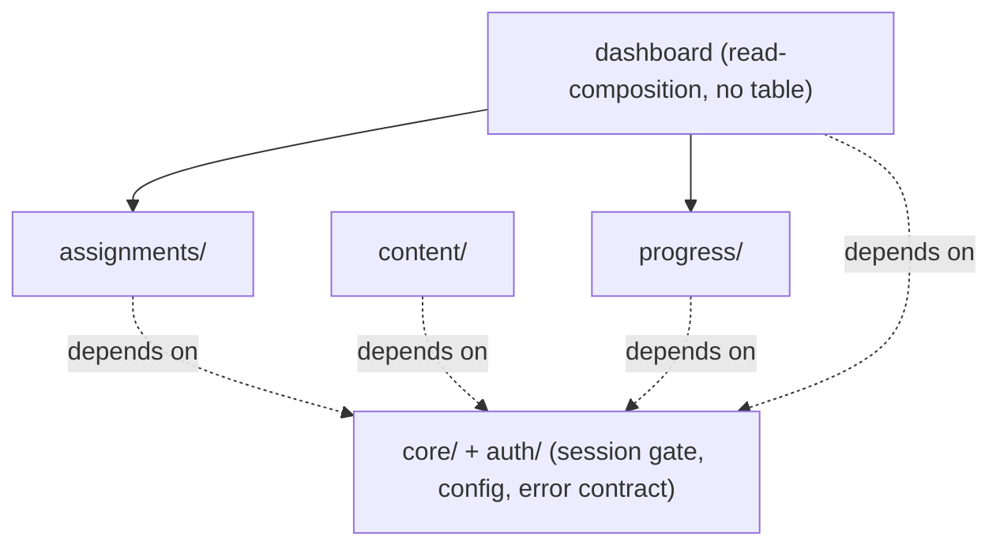
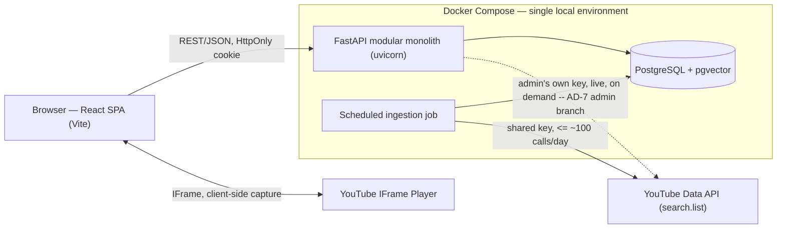
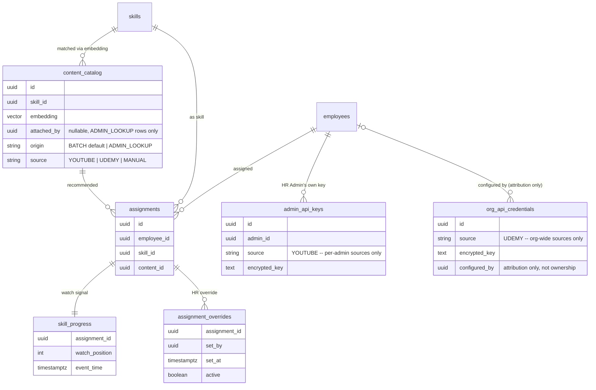

# Architecture Spine — TalentPilot-AI

## Design Paradigm

**Modular monolith.** One FastAPI application, one Postgres+pgvector instance, one React SPA — deliberately not microservices (over-engineering for an internal single-environment pilot). The app is divided into **feature-domain modules**, each internally layered **Router → Service → Repository** (+ `models.py` SQLAlchemy, `schemas.py` Pydantic). A feature is understood by opening one folder, not by walking layers across the tree.

| Module | Owns (sole read+write) | Realizes |
| --- | --- | --- |
| `auth/` | accounts, session/role gate | FR-13, FR-14 |
| `assignments/` | `assignments` | FR-1, FR-2 |
| `content/` | `content_catalog` (+ embeddings), `admin_api_keys`, `org_api_credentials`, batch ingestion job, admin live-lookup (YouTube + Udemy) | FR-3, FR-4, FR-16, FR-17, FR-18 |
| `progress/` | `skill_progress`, `assignment_overrides`, readiness derivation | FR-5..FR-12 |
| `dashboard` (read-composition, owns no table) | — | FR-8..FR-11 (HR read surface) |
| `core/` | config, JWT/security, CORS, error contract | cross-cutting |

Frontend mirrors these as feature folders (`src/features/{dashboard,content-discovery,video-progress,assignment,auth}`), shared presentational components + per-resource API clients at top level.

## Invariants & Rules

The durable heart — the calls a future builder cannot read off compliant code. IDs are stable; `[ADOPTED]` marks calls already settled by a source input or an explicit decision this session.

### AD-1 — Single-owner data modules

- **Binds:** `assignments`, `content_catalog`, `skill_progress`, `assignment_overrides`; all modules
- **Prevents:** two features writing or reading one entity in incompatible ways; scattered table access that would make coaching-only and derivation-coherence unenforceable
- **Rule:** each table has exactly one owning module (per the paradigm table). Only that module's Repository touches the table; every other feature goes through the owning module's Service API. No module imports, queries, or writes another module's tables directly. `[ADOPTED — user, this session]`

### AD-2 — Coaching-only is a read boundary [ADOPTED]

- **Binds:** `skill_progress`, `progress/`; FR-9, §9, NFR "Coaching-only enforcement"
- **Prevents:** auto-captured Watch Progress leaking into any performance-evaluation-shaped interface, export, or report
- **Rule:** `skill_progress` is reachable only through `progress/`'s coaching-shaped read methods — single-assignment status, and single-row drill-down. No bulk, cross-employee, raw-history, or export read method exists to call. Enforced at the service/repository layer, not by UI convention. This is launch-blocking (PRD §9).

### AD-3 — Single derivation authority for (Status, Provenance)

- **Binds:** FR-8, FR-10, FR-12; every surface that shows a Status badge or Provenance Label
- **Prevents:** the same assignment rendering an inconsistent Status or trust signal across surfaces (the divergence half of PRD Open Question 11)
- **Rule:** effective `(Status, Provenance)` is derived in exactly one place — `progress/` — from `{watch signal, self-report staleness (7 days), active HR override}`. No other module (dashboard, assignment flow, frontend) computes Status or Provenance from raw columns. Consumers ask `progress/` for the already-reconciled pair. **Status** ∈ {Not Started, In Progress, Completed} (from Watch % 0 / 1–99 / 100) and **Provenance** ∈ {Verified, Self-reported, Needs Attention, HR Override} are **orthogonal axes** — Needs Attention is a Provenance value, never a Status (correcting the prototype's conflation). An Assignment with no recorded watch signal derives as **Not Started** — no `skill_progress` row need pre-exist, so `assignments/` never has to write into `progress/`'s domain to create one. Whether the pair is computed on read or cached on the row is `progress/`'s private choice (see Deferred).

### AD-4 — HR Override is a separate, coexisting record

- **Binds:** FR-12; `assignment_overrides`, `progress/`
- **Prevents:** an override overwriting/erasing the watch signal it should coexist with; a manual override masquerading as auto-verified data
- **Rule:** an HR Override is stored as its own record — attributed to the HR Admin, timestamped, reversible — never a field-overwrite on `skill_progress`. Derivation: an active override wins the effective Status; its Provenance is **HR Override** and is never merged into or displayed as **Verified**. Fresh Watch Progress arriving on an overridden row does not replace the override; both remain visible in drill-down until an HR Admin explicitly changes it. Set/reverse flows through a `progress/` write method (a second validated write path alongside AD-5).

### AD-5 — Watch-progress write path [ADOPTED]

- **Binds:** FR-5, FR-7, §8 (Data integrity, Write integrity); `skill_progress`
- **Prevents:** stale out-of-order writes regressing progress; a legitimate rewind being wrongly dropped; client-forged progress being trusted as Verified
- **Rule:** `skill_progress` mutates only via `progress.record_watch_progress()`, which (1) takes the Employee identity from the authenticated session, never the request body; (2) is a **conditional write ordered by client event-timestamp** — skip if the incoming event-time is not newer than what is stored — ordered by time, **never by position magnitude**, so a lower position with a newer timestamp (a real rewind) is accepted while an older-timestamp write is dropped; (3) applies **server-side anti-spoofing** — reject position advances inconsistent with real playback (e.g. an instantaneous jump toward 100%) and require the write be tied to the caller's own real Assignment. Only writes passing all three persist and are eligible to derive as Verified.

### AD-6 — Server-side session/role/identity gate on every request [ADOPTED]

- **Binds:** FR-13, FR-14, Open Question 12; all protected endpoints
- **Prevents:** unauthenticated data exposure; an Employee reaching another Employee's data; enforcement that lives only at login/routing or only client-side
- **Rule:** every protected request passes a `core`/`auth` FastAPI dependency that (a) requires a valid JWT from the HttpOnly/Secure/SameSite cookie before any Assignment/Content/Watch-Progress data is served — no flash of protected content before redirect; (b) resolves role + identity from the verified token, never from request params; (c) scopes every query by role — an **Employee** session is hard-scoped to its own identity and can only ever reach its own Assignments/Content/Progress regardless of how the request is formed, while an **HR Admin** session may read org-wide but only through the coaching-shaped read methods of AD-2, never a raw/export path; (d) refuses a valid session presented against a role it lacks with an explicit access-denied, not an empty result. The prototype's latent employee-switch (`getEmployees`/`setSelectedEmployee`) is a hard non-goal — no endpoint exposes it.

### AD-7 — Content ingestion: batch-only on the shared key; a narrow admin-triggered live-lookup exception [AMENDED 2026-09-08, EXTENDED 2026-09-08]

- **Binds:** FR-3, FR-4, FR-16, FR-17, FR-18; `content/`, `content_catalog`, `admin_api_keys`, `org_api_credentials`
- **Prevents:** exhausting YouTube's ~100 search.list calls/day shared batch quota via live per-request search; surfacing a misleading low-relevance auto-match; an admin-triggered live lookup silently drawing on the shared system key or writing to the catalog without human review; a live Udemy lookup being blocked from build only because its credential shape differs from YouTube's
- **Rule:** the true invariant is **the shared batch key/quota is never touched by a live per-request call** — not "no router ever calls a search function." Three paths follow from that:
  1. **System-driven (unchanged):** `content_catalog` rows behind the AI-matched Content shown to Employees (FR-3/FR-4) come only from the scheduled batch ingestion job (`run_ingestion_job`, using `settings.YOUTUBE_API_KEY`) — never a live per-request call. Recommendations remain **filter-then-rank**: metadata pre-filter on skill tag, then pgvector cosine ranking, with a relevance threshold below which **no** recommendation is returned. `run_ingestion_job` and `settings.YOUTUBE_API_KEY` must never be referenced from any `router.py` or `main.py`.
  2. **Admin-driven, per-admin credential (YouTube):** an authenticated **HR_ADMIN** session may trigger a **live** search (reusing `youtube_client.search_videos()`, which already takes a caller-supplied `api_key` — Story 2.3), but only when the `api_key` passed is that Admin's own key from `admin_api_keys` (AD-10), **never** `settings.YOUTUBE_API_KEY`.
  3. **Admin-driven, org-shared credential (Udemy) [EXTENDED 2026-09-08]:** the same live, HR_ADMIN-gated path also covers Udemy, via a new `content/udemy_client.py` mirroring `youtube_client.py`'s shape, using the single org-wide credential from `org_api_credentials` (AD-10) — never a per-admin key, since Udemy for Business issues credentials per organization, not per user. Rate-limit handling follows the same principle already established for YouTube (Story 2.3): **trust the source API's own rate-limit signal** (its real 429/equivalent response) rather than build a local call counter or concurrency semaphore — proportionate for this project's small internal-pilot scale (a handful of HR Admins, not a large concurrent user base). A rate-limit hit surfaces as a clear, source-specific error (FR-17) — it never silently blocks or queues the request.
  For both (2) and (3): results are returned to the Admin for review and written to `content_catalog` (`origin=ADMIN_LOOKUP`, `attached_by=<admin id>`, `source=YOUTUBE`|`UDEMY`) **only** on an explicit attach action (FR-18) — never auto-written from the search call itself. A **queue-to-batch model was considered for Udemy specifically and rejected**: it would make Udemy results appear later than YouTube's for what the product presents as one lookup feature (FR-17), reintroducing the same live-vs-deferred inconsistency already rejected for YouTube in this AD's first amendment.
- **Regression guard (re-scoped):** the AD-7 test asserts (a) `run_ingestion_job` is never referenced from any `router.py`/`main.py` (unchanged), and (b) `settings.YOUTUBE_API_KEY` is never referenced from any `router.py`/`main.py` — the actual boundary both carve-outs depend on. It does not forbid `search_videos`/`udemy_client` calls from a router, since the admin-lookup router path calls them legitimately with admin- or org-scoped credentials, never the system key.

### AD-10 — Content-source API credentials: encrypted, module-owned, never exposed [NEW 2026-09-08, EXTENDED 2026-09-08]

- **Binds:** FR-16; `admin_api_keys`, `org_api_credentials`, `content/`
- **Prevents:** API keys/credentials stored in plaintext or logged; a leaked JWT signing secret also decrypting stored credentials; any endpoint ever returning a stored credential's plaintext to a client; one table's uniqueness constraint being forced to express two different ownership models (personal vs. org-shared)
- **Rule:** two tables, both owned by `content/` (AD-1), both encrypted with **Fernet** symmetric encryption (`cryptography` lib) keyed by a dedicated `ADMIN_KEY_ENCRYPTION_SECRET` — deliberately **not** `JWT_SECRET` (a leaked session-signing secret must not also decrypt stored credentials):
  - `admin_api_keys` (`admin_id`, `source`, `encrypted_key`, timestamps; unique on `admin_id`+`source`) — **per-admin** credentials. YouTube only, v1.
  - `org_api_credentials` (`source`, `encrypted_key`, `configured_by` [FK `employees.id`, attribution only — "connected by {name}," not an ownership scope], timestamps; unique on `source`) — **org-wide** credentials, one row per source. Udemy only, v1.
  - `[EXTENDED 2026-09-08]` Which table a source uses is a small explicit mapping, not scattered conditionals: `CREDENTIAL_SCOPE = {YOUTUBE: PER_ADMIN, UDEMY: ORG_WIDE}` in `content/` — extensible for a future source without another schema change. `content/service.py::get_source_credential(source, admin_id)` is the one place that reads this mapping and fetches from the correct table.
  - Encrypt/decrypt logic lives in `core/secrets.py` (generic, domain-free — mirrors `core/embedding.py`'s placement), called only from `content/repository.py`, never from a router. Any read endpoint for a credential returns only a boolean "configured" flag per source (FR-16) — the ciphertext and the decrypted value never leave `content/`'s repository layer except to be passed as the `api_key` argument into `youtube_client.search_videos()`/`udemy_client`'s equivalent (AD-7) within the same request.

### AD-8 — Module dependency direction

- **Binds:** all modules
- **Prevents:** dependency cycles and back-references that let the dashboard's read shape leak into the write-owning modules
- **Rule:** dependencies point one way — the `dashboard` read-composition depends on `assignments` and `progress` read APIs; those modules never depend on the dashboard. `auth`/`core` is a cross-cutting dependency every protected module uses; it depends on none of them. Cross-module calls are Service-API only (AD-1). See diagram.


```mermaid
graph TD
    Core["core/ + auth/ (session gate, config, error contract)"]
    Assign["assignments/"]
    Content["content/"]
    Progress["progress/"]
    Dash["dashboard (read-composition, no table)"]

    Dash --> Assign
    Dash --> Progress
    Assign -. depends on .-> Core
    Content -. depends on .-> Core
    Progress -. depends on .-> Core
    Dash -. depends on .-> Core
```

### AD-9 — Video capture behind a player Adapter [ADOPTED]

- **Binds:** FR-5, FR-6; `progress/` capture pipeline
- **Prevents:** YouTube-specific API details leaking into the capture/progress pipeline, blocking the locked future-Vimeo swap
- **Rule:** the capture pipeline depends on an abstract **player-adapter interface** (normalized `position` + `event-time` + play/pause/ended events), never on YouTube's API surface directly. YouTube's polling `getCurrentTime()`/`onStateChange` lives only behind the adapter; a Vimeo (event-driven `timeupdate`) implementation must be swappable without touching `progress/`. The client-side flush on tab-close/visibilitychange via `sendBeacon` (FR-5, §8 reliability) is part of this boundary.

## Consistency Conventions

| Concern | Convention |
| --- | --- |
| Backend modules | `app/{module}/` each with `router.py`, `service.py`, `repository.py`, `models.py` (SQLAlchemy), `schemas.py` (Pydantic). Cross-module access via Service API only. |
| Naming | Tables snake_case plural (`assignments`, `skill_progress`, `content_catalog`, `assignment_overrides`, `admin_api_keys`). REST resources plural-noun, ≤2 levels deep (`/api/assignments`, `/api/skills/{id}/content`, `/api/assignments/{id}/progress`). Admin-only routes prefixed `/api/admin/...` and gated HR_ADMIN via AD-6 (`/api/admin/api-keys`, `/api/admin/skills/{id}/content-lookup`, `/api/admin/content/attach`). Frontend feature folders mirror backend module names. |
| IDs & time | Entity IDs opaque UUIDs; storage keys never leaked as API contract. All timestamps ISO-8601 UTC. Watch-progress writes carry an explicit client **event-time** field (AD-5 orders on it). |
| API schemas | Pydantic request/response schemas kept separate from SQLAlchemy ORM models (storage shape must not leak into the contract). Client mirrors them as TS types in `src/types`. |
| Errors | One JSON error contract (`status`, `code`, `message`, `timestamp`) via centralized FastAPI exception handlers; 422 on validation. A failed dashboard refresh after a successful save is a distinct **refresh error**, never a lost Assignment (FR-1). Empty vs error are distinct states, per condition (FR-4). |
| Auth & CORS | JWT in HttpOnly/Secure/SameSite cookie, verified server-side per request (AD-6). `CORSMiddleware` with explicit allowed origins (local dev + built SPA origin), never `*` with credentials. |
| Accessibility | Status badges and Provenance Labels never color-only — always paired with text/icon (WCAG 2.1 AA); live updates announced to screen readers. |
| Validation | Client: React Hook Form + Zod (UX only). Server: Pydantic is the real guard. |
| Real-time | Live dashboard row updates (FR-11, ≤30s) via **client polling** of the dashboard read endpoint — no WebSocket/SSE (research: no server-push requirement). Capture posts periodically (every 5–10s) plus a `sendBeacon` flush on tab-close. |

## Stack

Seed — verified current for 2026 in the overall-stack research (2026-07-08); the code owns exact versions once it exists.

| Name | Version |
| --- | --- |
| Python | 3.12+ |
| FastAPI + uvicorn | current |
| SQLAlchemy (async) + asyncpg | 2.0 |
| PostgreSQL + pgvector | 16+ / current |
| Embedding model | local `sentence-transformers` (e.g. `all-MiniLM-L6-v2`, 384-dim) — free/offline, no API key (supersedes the addendum's `text-embedding-3-small` under zero-budget/local-only) |
| React + TypeScript + Vite | current |
| shadcn/ui + Tailwind CSS | current |
| React Hook Form + Zod | current |
| YouTube IFrame API | polling (`getCurrentTime()`/`onStateChange`), behind an Adapter |
| YouTube Data API v3 (`search.list`, `videos.list`) | current — used by both the batch job (shared key) and admin live-lookup (per-admin key), AD-7 |
| Udemy for Business API | current — org-wide credential, admin live-lookup only (no batch use), AD-7 branch 3 |
| `cryptography` (Fernet) | current — per-admin + org-wide credential encryption at rest, AD-10 |
| Docker Compose (local only) | current |
| pytest + httpx / Vitest + RTL | current |

## Structural Seed

### Runtime topology (local only — no production deployment)


```mermaid
graph LR
    Browser["Browser — React SPA (Vite)"]
    API["FastAPI modular monolith (uvicorn)"]
    DB[("PostgreSQL + pgvector")]
    Cron["Scheduled ingestion job"]
    YT["YouTube IFrame Player"]
    YTAPI["YouTube Data API (search.list)"]

    Browser -->|REST/JSON, HttpOnly cookie| API
    Browser <-->|IFrame, client-side capture| YT
    API --> DB
    Cron --> DB
    Cron -->|shared key, <= ~100 calls/day| YTAPI
    API -.->|admin's own key, live, on demand -- AD-7 admin branch| YTAPI

    subgraph Local["Docker Compose — single local environment"]
        API
        DB
        Cron
    end
```

### Core entities


```mermaid
erDiagram
    employees ||--o{ assignments : "assigned"
    skills ||--o{ assignments : "as skill"
    content_catalog ||--o{ assignments : "recommended"
    skills ||--o{ content_catalog : "matched via embedding"
    assignments ||--|| skill_progress : "watch signal"
    assignments ||--o{ assignment_overrides : "HR override"
    employees ||--o{ admin_api_keys : "HR Admin's own key"
    employees |o--o{ org_api_credentials : "configured by (attribution only)"

    assignments {
        uuid id
        uuid employee_id
        uuid skill_id
        uuid content_id
    }
    skill_progress {
        uuid assignment_id
        int watch_position
        timestamptz event_time
    }
    assignment_overrides {
        uuid assignment_id
        uuid set_by
        timestamptz set_at
        boolean active
    }
    content_catalog {
        uuid id
        uuid skill_id
        vector embedding
        uuid attached_by "nullable, ADMIN_LOOKUP rows only"
        string origin "BATCH default | ADMIN_LOOKUP"
        string source "YOUTUBE | UDEMY | MANUAL"
    }
    admin_api_keys {
        uuid id
        uuid admin_id
        string source "YOUTUBE -- per-admin sources only"
        text encrypted_key
    }
    org_api_credentials {
        uuid id
        string source "UDEMY -- org-wide sources only"
        text encrypted_key
        uuid configured_by "attribution only, not ownership"
    }
```

Note: `skill_progress` is keyed by `assignment_id` (not `user_id`+`skill_id` as DD-001 sketched) because FR-1 permits a second intentional Assignment of the same skill to the same Employee — the watch signal belongs to the Assignment, not the (employee, skill) pair.

### Source tree

```text
backend/app/
  core/          # config, JWT/security, CORS, error handlers, secrets.py (Fernet encrypt/decrypt, AD-10)
  auth/          # login, session/role gate dependency (FR-13/14)
  assignments/   # assignments table + FR-1/FR-2 flow
  content/       # content_catalog + embeddings + admin_api_keys + org_api_credentials; matching (FR-3),
                 # discovery list (FR-4); batch ingestion job (shared key, youtube_client.py);
                 # admin key mgmt (FR-16) + live lookup/attach (FR-17/18) via youtube_client.py (per-admin)
                 # + udemy_client.py (org-wide)
  progress/      # skill_progress + assignment_overrides; capture (FR-5/6/7), readiness derivation (FR-8..12)
  dashboard/     # read-composition over assignments + progress (owns no table)
  main.py
frontend/src/
  api/           # per-resource clients
  components/    # shared presentational (Badge, Modal, ...)
  features/      # dashboard, content-discovery, video-progress, assignment, auth, admin-content-sourcing
  types/         # TS mirrors of Pydantic schemas
```

## Capability → Architecture Map

| FR | Lives in | Governed by |
| --- | --- | --- |
| FR-1, FR-2 (assign + content review) | `assignments/`, reads `content/` | AD-1, AD-8; error conventions |
| FR-3 (semantic match) | `content/` | AD-7 |
| FR-4 (discovery list) | `content/` + frontend | AD-1, AD-6 (own-data scope) |
| FR-5 (capture) | `progress/` + YouTube Adapter | AD-5, AD-9 |
| FR-6 (resume) | `progress/` + YouTube Adapter | AD-5 (reads last position), AD-9 |
| FR-7 (event-time ordering) | `progress/` | AD-5 |
| FR-8 (Status badge) | `dashboard` ← `progress/` | AD-3 |
| FR-9 (provenance drill-down) | `dashboard` ← `progress/` | AD-2, AD-3 |
| FR-10 (Needs Attention staleness) | `progress/` derivation | AD-3 |
| FR-11 (auto row update) | `dashboard` ← `progress/` | AD-3, AD-5 |
| FR-12 (HR override) | `progress/` | AD-4 |
| FR-13, FR-14 (session/role gate) | `auth/` + `core/` | AD-6 |
| FR-16 (per-Admin + org-wide credential mgmt) | `content/` + `core/secrets.py` | AD-10 |
| FR-17 (admin live content-link lookup, YouTube + Udemy) | `content/` (admin-lookup path) | AD-7 (admin-driven branches 2 & 3), AD-6 (HR_ADMIN gate) |
| FR-18 (admin review + attach as Content) | `content/` | AD-7 (write-on-review-only), AD-1 |

## Deferred

- **Production deployment / hosting** — out of scope this build (OQ7 resolved: local working copy only). Revisit only if the pilot moves beyond local. No Kubernetes / serverless-FaaS split / multi-region under any later choice (research constraint).
- **SSO + HRIS roster sourcing** (OQ9 hosted half) — local build seeds accounts/roster; company SSO and roster integration deferred to any hosted version.
- **Compute-on-read vs cached (Status, Provenance) column** — mechanism owned privately by `progress/` (AD-3); not a spine invariant.
- **Proactive dead-content detection / auto-re-matching** (OQ10) — MVP surfaces unavailable content through the existing FR-4/FR-5 video error states only; the Assignment is never lost. Proactive handling deferred.
- **Video-specific staleness for Verified rows** (FR-10 open) — only Self-reported staleness (7d) is defined; whether an abandoned-mid-video Verified row should flag Needs Attention has no source threshold.
- **Self-reported non-video status entry** — no FR provides an in-product entry mechanism; non-video cells stay blank/Unknown or come from outside the product.
- **Data retention period for Watch Progress** (OQ1) — no default locked; does not block MVP.
- **Status/Provenance UI coherence** (OQ11 UX half) — AD-3 closes the structural divergence; whether a badge alone reads clearly, and whether stale rows need a secondary at-a-glance cue, is a UX decision, not an architecture one. Pairs with the untested label-comprehension check (OQ8).
- **Udemy as a content source** (PRD Open Question 14) — **RESOLVED, in scope 2026-09-08.** Briefly deferred earlier the same day (Udemy's free Affiliate API is discontinued; the remaining APIs require a paid Udemy for Business subscription), then restored once SAILS confirmed it already holds that subscription — an existing cost, not new paid infrastructure. See AD-7 (admin-driven branch 3) and AD-10 (`org_api_credentials`) for the resulting design.
- **Queue-to-batch alternative for admin lookup — considered twice, rejected both times.** Once for YouTube (AD-7's original amendment) and again for Udemy specifically (AD-7's extension) — an Admin's request enqueuing a row for the next batch run would keep AD-7 fully unamended, but breaks the "enter a skill, see links now" UX FR-17 was written for, and would make the two sources behave inconsistently within one feature. Logged here so the trade-off isn't silently forgotten if either carve-out ever proves operationally painful and this gets revisited.
- **Concurrent-Admin rate-limit contention on `org_api_credentials`** — not proactively engineered against (no semaphore/local throttle), consistent with this project's small internal-pilot scale (a handful of HR Admins). If usage ever grows enough that concurrent Udemy lookups routinely collide on the org-wide rate limit, revisit AD-7 branch 3 for an explicit queueing/backoff layer at that point — premature to build now.
