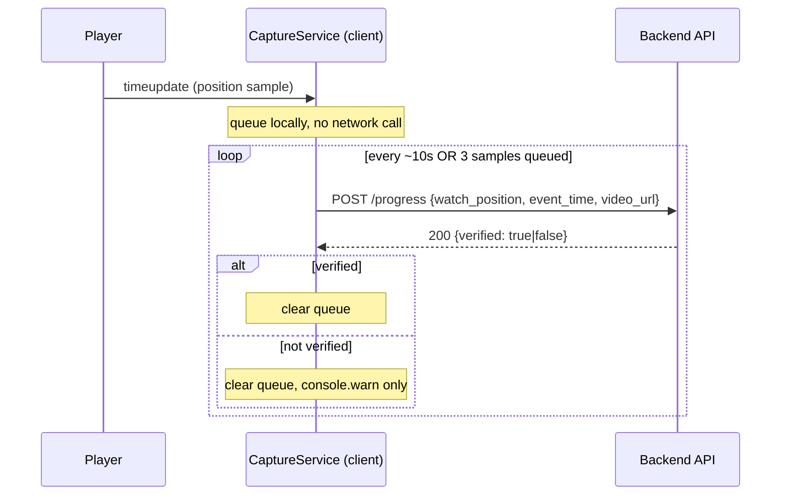
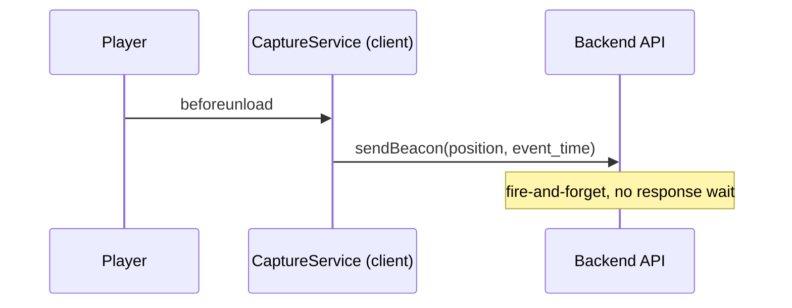

# Video Progress Tracking — What and How APIs Are Called

Companion to [PROGRESS-TRACKING-DESIGN.md](./PROGRESS-TRACKING-DESIGN.md) (workflow/derivation architecture). This doc is the API-call mechanics only: which endpoint, when it fires, what's in the payload, and how failures are handled.

## 1. Resuming a video — one-time GET on page load

```
GET /api/assignments/{assignment_id}/progress
```

When the employee opens a video, the player asks "where did I leave off?" The server returns the last saved `watch_position` (`0` if never watched, or as a fail-safe if the stored value is out of bounds). The player seeks to that spot before playing. Called once per page load — not polled.

## 2. While watching — batched POST, not one call per tick

The player does **not** call the API on every `timeupdate` tick. Instead:

- Every `timeupdate` event queues a sample locally (`{ position, event_time }`) — no network call yet.
- Every **10 seconds**, OR as soon as **3 samples** have queued (whichever comes first), the client fires one POST carrying only the **latest** queued sample (older samples in that batch are discarded):

```
POST /api/assignments/{assignment_id}/progress
Body: { "watch_position": 245, "event_time": "2026-07-15T10:32:01Z", "video_url": "..." }
```

- The server runs its anti-spoofing checks (session identity, position bounds, playback rate ≤10x, event-time within ±5 min of server clock — see `PROGRESS-TRACKING-DESIGN.md` §1) and responds with `{ verified: true|false, ... }`.
- If `verified: false`, the client only logs a console warning — playback is never interrupted. The write is still persisted (silent-rejection pattern), just not trusted for Status derivation.



## 3. Network hiccups — retry with backoff

If the POST fails, behavior depends on the error:

| Failure | Behavior |
|---|---|
| Network error / 5xx | Sample re-queued, retried with exponential backoff (1s → 2s → 4s ... capped at 30s) |
| 401 / 403 (auth) | Queue dropped — not transient, no point retrying |
| 422 (bad payload) | Queue dropped — retrying identical bad data won't help |
| Other 4xx | Re-queued with backoff (treated as transient) |

## 4. Closing the tab — fire-and-forget beacon

On `beforeunload`, the client uses `navigator.sendBeacon()` instead of a normal POST — a one-way "send this and don't wait for a reply" call that survives the tab actually closing mid-flight. No response is read; this is best-effort delivery of the last known position.



## 5. HR Admin side

| Call | Trigger | Frequency |
|---|---|---|
| `GET /api/dashboard` | Dashboard mounts | Polled every **12s** while the tab is visible (paused when hidden) |
| `GET /api/assignments/{id}/progress/drill-down` | Admin clicks a row | One-off, on click |
| `POST /api/assignments/{id}/override` | Admin clicks "Mark as Ready" / reverses an override | One-off, on click |
| `DELETE /api/assignments/{id}` | Admin clicks the trash icon and confirms | One-off, on confirm |

## Summary

- **Writes are batched and throttled** — max one `POST /progress` per 10s per assignment, never per-tick.
- **Every write is validated server-side** before being trusted for Status derivation, but never rejected outright (silent-rejection pattern).
- **Reads are polled** only on the dashboard (12s), never on the video player (resume is a single GET on load).
- **Nothing blocks the user** — failed validation, failed network calls, and tab closes all degrade gracefully without interrupting playback.
