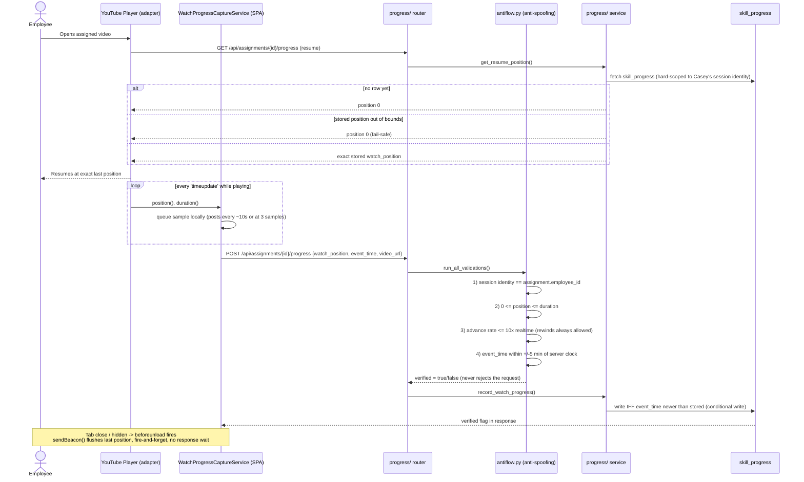
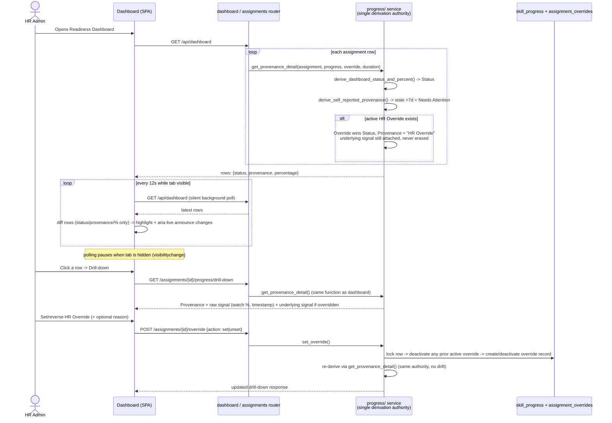

# TalentPilot-AI — Watch Progress Tracking (Employee capture & HR Admin dashboard)

How an Employee's video-watch behavior becomes a validated `skill_progress` write, and how that same data reaches the HR Admin's Readiness Dashboard as a trustworthy Status/Provenance badge.

## 1. Employee workflow — capture, validated write, resume

The player never talks to the backend directly. A capture service batches position samples and posts them; the backend independently validates every write before trusting it.

- **Capture:** `WatchProgressCaptureService` listens to the player adapter's `timeupdate` event, queues samples locally, and posts the latest sample every ~10s or once 3 samples have queued — not on every tick.
- **Anti-spoofing (`antiflow.py`):** every write runs four checks before being trusted — session identity must match the assignment's employee, position must be within `[0, duration]`, the advance rate must be realistic (≤10x realtime; rewinds always pass), and the client's event-time must be within ±5 minutes of the server clock. A failed check doesn't reject the request — it persists the write with `verified=false` for forensics (silent-rejection pattern).
- **Conditional write:** the row is only overwritten if the incoming `event_time` is newer than what's stored — ordering by time, not position, so a legitimate rewind (lower position, newer timestamp) is still accepted.
- **Resume:** on next visit, the resume endpoint is Employee-only and hard-scoped to the caller's own session identity; it returns the exact stored position (0 on first view, or as a fail-safe if the stored value is out of bounds).
- **Tab close:** `beforeunload` flushes the last known position via `navigator.sendBeacon()` — fire-and-forget, no response wait.

## 2. HR Admin workflow — dashboard polling, derivation, drill-down, override

The dashboard never reads raw watch data. Every row's Status and Provenance are computed by one shared derivation function, called identically by the grid, the drill-down modal, and the override mutation — so the three surfaces can never disagree about the same assignment.

- **Derivation authority:** `get_provenance_detail()` composes Status (from watch % vs. video duration) and Provenance (Verified / Self-reported / Needs Attention past 7 days / HR Override) in one place. Status and Provenance are orthogonal — a stale row is `In Progress` + `Needs Attention`, never a Status of "Needs Attention".
- **Live updates:** the dashboard silently polls every 12 seconds while the tab is visible (paused when hidden), diffs rows by status/provenance/percentage only, and announces changed rows via an `aria-live` region rather than reloading the whole grid.
- **Drill-down:** reached from any row, calls the exact same derivation function as the grid — showing the raw signal (watch %, timestamp) behind the badge.
- **HR Override:** a separate, coexisting record — never a field overwrite on `skill_progress`. Setting one deactivates any prior active override first (at most one active override per assignment), and an active override wins the effective Status while the underlying (pre-override) signal stays visible in the drill-down rather than being erased.

## 3. Why the two workflows never collide

- **Separate write paths, one per role.** Only `record_watch_progress()` writes `skill_progress`, and it explicitly rejects an HR_ADMIN session trying to report progress (`antiflow.py`, `validate_session_identity`). Only `set_override()` writes `assignment_overrides`. Neither role can write into the other's table.
- **One read authority.** The dashboard grid, the drill-down modal, and the override response all resolve through `get_provenance_detail()` / `derive_dashboard_status_and_percent()` in `progress/service.py` — never re-derived independently, so the same assignment can't show a different answer on two different screens.
