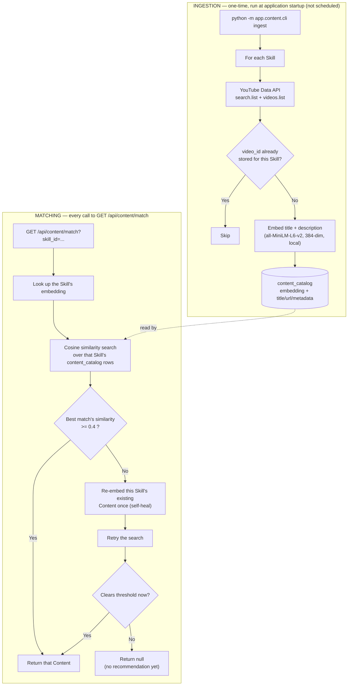

# TalentPilot-AI — Content Ingestion & Semantic Matching

How YouTube videos get into the system, how they're embedded, and how `GET /api/content/match` picks the right one for a Skill.

## 1. Ingestion — fetching videos from YouTube

Ingestion is a **one-time step, run once when the application/environment is stood up** (`python -m app.content.cli ingest`) — there is no scheduled or recurring ingestion job. YouTube's free `search.list` quota (~100 calls/day) rules out fetching live on every request anyway, so ingestion and matching are two separate phases: fetch-and-store once, then query the stored rows on every subsequent request.

For each Skill, ingestion:

1. Calls the YouTube Data API (`search.list`) with the Skill name as the query, then `videos.list` to get each result's duration.
2. Skips any `video_id` already stored for that Skill (de-dup).
3. Builds an embedding from `"{title}: {description}"` (truncated to 1000 chars) and stores a new `content_catalog` row: title, description, URL, source, embedding, and metadata (`video_id`, `duration`, `thumbnail_url`).

## 2. Semantic search & embeddings

- **Model:** `all-MiniLM-L6-v2`, a local `sentence-transformers` model, 384-dim vectors. Runs in-process — no external API call, no per-request cost.
- Both **Skills** and **Content** are embedded the same way, so they land in the same vector space and can be compared directly.
- **Similarity:** pgvector `cosine_distance` between a Skill's embedding and each of its Content rows' embeddings.
- **Relevance floor:** a match must clear a similarity threshold (`0.4`) to be returned at all — below that, the system returns "no recommendation" rather than a bad guess.
- **Self-heal retry:** if nothing clears the threshold, existing Content for that Skill is re-embedded once (in case its stored vector drifted from what the current embedding code would produce) and the search retries — no YouTube call involved, this only recomputes vectors for rows that already exist.

## 3. Diagram

## 4. How `GET /api/content/match` works

1. **Router** (`content/router.py`) takes `skill_id` as a query parameter and requires an authenticated session (any role). It calls straight through to the service — no logic in the route itself.
2. **Service** (`content/service.py`, `match_content_for_skill`) looks up the Skill's stored embedding. If the Skill has no embedding, it returns `None` immediately.
3. **Repository** (`content/repository.py`, `find_best_matching_content`) runs the cosine-distance query: filter to that Skill's Content rows, order by distance ascending, take the top one, but only if its distance clears the `0.4` similarity floor.
4. If nothing clears the floor, the service re-embeds that Skill's existing Content and retries the same query once.
5. The endpoint returns either the matched Content (title, URL, thumbnail, duration) or `null` — a `null` is a normal "nothing approved yet" result, not an error, and the frontend (Assignment Modal Step 3, Employee Content Discovery) shows "Assign without content" / an empty state for it rather than surfacing a failure.
