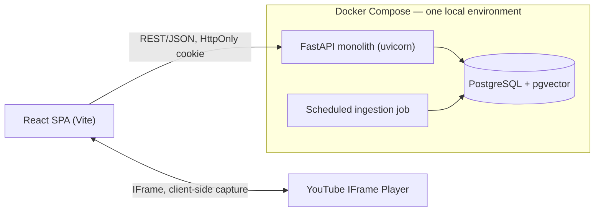
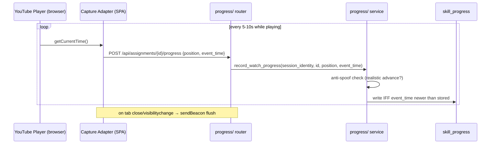
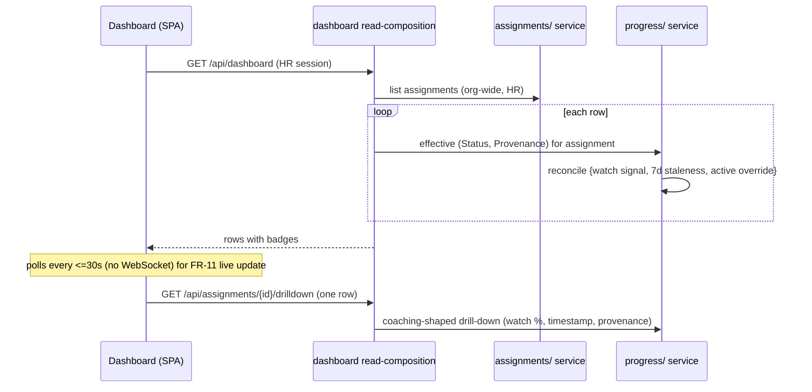
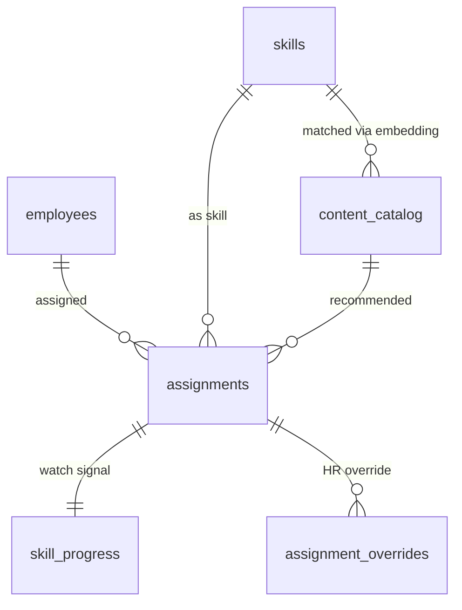

# TalentPilot-AI — Solution Design

This is the human-readable companion to [`ARCHITECTURE-SPINE.md`](ARCHITECTURE-SPINE.md). The spine is the terse contract — the invariants (`AD-1..AD-9`) a builder must not violate. This document explains *why* each one exists and shows the concrete request/write flows, the data model, and the local setup. Where the two disagree, the spine wins.

**What we're building:** an internal HR pilot that replaces manual self-reporting of skill progress with *automatic* capture from video watch behaviour. HR (Rita) assigns skills and reads a readiness dashboard; employees (Casey) watch recommended videos and resume where they left off — never typing a status update. The differentiator is honesty: the dashboard shows, at a glance, which cells are auto-**Verified** and which are still **Self-reported**.

**Scope of this build:** a working **local** copy — no production deployment (resolved Open Question 7). Zero budget, fully offline where possible.

---

## 1. Architecture at a glance

A **modular monolith**: one FastAPI app, one PostgreSQL+pgvector database, one React SPA. No microservices — that would be pure overhead for a single-environment internal pilot. The app is split into **feature-domain modules**, each internally layered Router → Service → Repository. You understand a feature by opening one folder, not by tracing a layer across the tree.

| Module | Owns (sole reader + writer) | Realizes |
| --- | --- | --- |
| `auth/` | accounts, the session/role gate | FR-13, FR-14 |
| `assignments/` | `assignments` table | FR-1, FR-2 |
| `content/` | `content_catalog` (+ embeddings), the ingestion job | FR-3, FR-4 |
| `progress/` | `skill_progress`, `assignment_overrides`, readiness derivation | FR-5..FR-12 |
| `dashboard` | *(owns no table — a read-composition)* | FR-8..FR-11 |
| `core/` | config, JWT/security, CORS, the error contract | cross-cutting |

The single most important structural idea: **`progress/` is the one authority on "how far along is this, and how much do we trust it."** It is the only writer *and* reader of watch data, the only place that derives Status and Provenance, and the only home for HR overrides. Everything else asks it. That one decision is what makes three separate hard requirements — coaching-only privacy, out-of-order write safety, and dashboard trust-coherence — enforceable in one place instead of scattered across every feature.

---

## 2. The load-bearing invariants, explained

The spine states these as rules; here's the reasoning a builder needs to not "optimize" them away.

### Single-owner data modules (AD-1) and coaching-only reads (AD-2)

Each table has exactly one owning module; nobody else touches it — cross-module access goes through the owner's Service API. This isn't ceremony. The launch-blocking privacy guarantee (§9: auto-captured Watch Progress must *never* reach a performance-evaluation surface) is only real if there's a single door to walk through. If the dashboard, an export feature, and a report each queried `skill_progress` directly, "coaching-only" would live in three sets of good intentions. Instead: `progress/` exposes only *coaching-shaped* reads — one assignment's status, one row's drill-down. There is **no** bulk / cross-employee / raw-history / export read method to call. You cannot accidentally build the surveillance view because the method to feed it does not exist.

### Single derivation authority (AD-3)

Status and Provenance are **derived**, not stored raw and re-interpreted. Three requirements feed the derivation — Status from Watch % (FR-8), the 7-day staleness flag (FR-10), and HR override (FR-12) — and if the dashboard computed it one way while the assignment flow computed it another, the same row would show two different answers. That *is* the product's core risk (Open Question 11: does a Status badge quietly reintroduce the trust-ambiguity we exist to remove?). We close the *structural* half of that risk by deriving `(Status, Provenance)` in exactly one place. The remaining half — whether a badge *reads* clearly to Rita, whether stale rows need an extra visual cue — is a UX question, deliberately left to design.

Two axes, kept orthogonal (the prototype conflated them — don't copy it):

- **Status** ∈ `Not Started` (0%) · `In Progress` (1–99%) · `Completed` (100%)
- **Provenance** ∈ `Verified` (auto video) · `Self-reported` (non-video) · `Needs Attention` (stale >7d) · `HR Override`

A stale row is `In Progress` (Status) + `Needs Attention` (Provenance) — never Status = "Needs Attention".

### HR Override as a separate, coexisting record (AD-4)

FR-12 requires that an override and fresh watch data *coexist* — both visible in the drill-down, the override standing until HR explicitly changes it. So an override cannot be a field you overwrite on `skill_progress` (that would erase the very signal it must sit beside). It's its own record — attributed, timestamped, reversible. Derivation rule: an active override wins the Status, its Provenance is `HR Override`, and it is *never* shown as `Verified`. A manual "I know Casey's ready" must never masquerade as machine-verified.

### The watch-progress write path (AD-5)

This is the trickiest correctness surface in the product. `skill_progress` is mutated only through `progress.record_watch_progress()`, which does three things:

1. **Identity from the session, never the request body.** The client cannot claim to be someone else.
2. **Conditional write ordered by client event-time — not by position.** If two tabs send updates out of order, we keep the one whose *timestamp* is newer. Crucially, ordering by *time* (not by position magnitude) is what lets a legitimate rewind through: an employee scrubbing back produces a *lower* position with a *newer* timestamp, and must be accepted. The naive "reject any lower position" rule would silently break rewinds (FR-7's explicit warning).
3. **Server-side anti-spoofing.** A position that jumps to 100% instantly isn't real playback. Only writes consistent with real watching, tied to the caller's own assignment, become eligible to derive as `Verified`. The Verified label is the whole product; it cannot rest on client-reported values.

### Server-side session/role/identity gate (AD-6)

Every protected request passes one FastAPI dependency that checks the JWT cookie, resolves role + identity from the *verified token* (not from params), and scopes the query. Scoping is role-aware: an **Employee** is hard-scoped to their own data — they can never reach another employee's, however the request is formed (this is the hard privacy Non-Goal, and the prototype's latent `getEmployees`/`setSelectedEmployee` switch is a hard no-op that no endpoint exposes). An **HR Admin** may read org-wide, but only through the coaching-shaped reads of AD-2. The prototype validated the *shape* of this client-side; the real build enforces it server-side, on every request.

### Ingestion is batch-only; matching is filter-then-rank (AD-7)

YouTube's search API allows ~100 calls/day — nowhere near enough for live per-request search. So `content/` fills `content_catalog` from a scheduled batch job, and matching runs entirely against already-ingested rows: pre-filter by skill tag, then rank by vector similarity within that set, with a relevance floor below which we show *nothing* rather than a bad guess. (Build-order consequence: ingestion must run at least once before matching has data.)

### Video capture behind an adapter (AD-9)

The capture pipeline talks to an abstract player interface (normalized position + event-time + play/pause/ended), never to YouTube's API directly. YouTube's polling lives behind the adapter so a future Vimeo swap — locked as a possibility in the addendum — doesn't ripple into `progress/`.

---

## 3. Key flows

### Watch-progress write (the core mechanic)

### Dashboard read + derivation

### Assignment flow (FR-1/FR-2)

Employee → skill → review auto-linked content → confirm. On confirm the row appears immediately as `Not Started` (no `skill_progress` row needs to exist yet — derivation treats "no signal" as Not Started). If the save succeeds but the dashboard refresh fails, the assignment is **not lost** — the UI shows a distinct *refresh* error. A cancel at any step is a true no-op. A duplicate (same employee+skill) surfaces the existing assignment rather than silently creating a second — though a second *intentional* one is allowed, which is why `skill_progress` is keyed by `assignment_id`, not by (employee, skill).

---

## 4. Data model

- `assignments` — employee × skill × (nullable) content. `content_id` is nullable because FR-2 allows assigning a skill with no matched content yet.
- `skill_progress` — keyed by `assignment_id`; holds `watch_position` + `event_time`. Conditional-write only (AD-5).
- `assignment_overrides` — separate record per override; `set_by`, `set_at`, `active` (AD-4).
- `content_catalog` — includes a `vector` embedding column (local `sentence-transformers`, 384-dim). IVFFlat index or none at pilot scale.

Pydantic API schemas stay separate from SQLAlchemy models — the storage shape (conditional-write columns, vector column) must not leak into the API contract.

---

## 5. Local setup & build order

**Run locally** (no cloud):

- `docker compose up` → PostgreSQL+pgvector.
- Backend: `uvicorn app.main:app --reload` (Python 3.12+, async SQLAlchemy 2.0 + asyncpg).
- Frontend: `vite` dev server (React + TS + shadcn/ui + Tailwind).
- Cookie note: on `http://localhost` the `Secure`/`SameSite` flags need dev-time handling — browsers treat localhost as a secure context, but plain-http `Secure` can be finicky. Implementation detail, not an invariant.

**Build order** (from the research roadmap, still valid):

1. Scaffold FastAPI with the module layout (`core/`, `auth/`, `assignments/`, `content/`, `progress/`, `dashboard/`); async engine + Postgres+pgvector connection.
2. Auth: JWT-in-cookie, the per-request gate dependency, CORS, centralized error handlers.
3. `progress/`: the write path (AD-5) + derivation authority (AD-3) + overrides (AD-4). This is the riskiest, most central piece — do it early.
4. `content/`: ingestion batch job first (AD-7 — nothing to match without it), then filter-then-rank matching.
5. `assignments/` + `dashboard/`: the HR surfaces, reading through `progress/`.
6. Frontend: capture adapter (AD-9) wired to the progress endpoint; content-discovery + resume; dashboard + drill-down; login/protected routes.
7. CI (GitHub Actions: backend `ruff`/`mypy`/`pytest`, frontend `eslint`/`tsc`/`vitest`). No deploy stage.

---

## 6. Open items carried forward

These are **not** blockers for the local build — they're logged so nobody mistakes them for solved:

| Item | State |
| --- | --- |
| Production deployment / hosting (OQ7) | Out of scope — local copy only. Revisit if the pilot goes beyond local. |
| SSO + HRIS roster (OQ9 hosted half) | Local build seeds accounts/roster; company SSO deferred. |
| Match quality of local embeddings | Start with `all-MiniLM-L6-v2`; swap to OpenAI only if quality disappoints. |
| Dead-content detection (OQ10) | MVP surfaces it through the existing video error state; proactive detection deferred. |
| Video-specific staleness (FR-10 open) | Only Self-reported 7-day staleness is defined; abandoned-video staleness has no source threshold. |
| Non-video self-reported entry | No FR provides an in-product entry mechanism; cells stay blank/Unknown. |
| Watch-progress retention (OQ1) | No default locked; does not block MVP. |
| Status/Provenance UI coherence (OQ11 UX half) | Structural half closed by AD-3; badge clarity + stale-row cue is a UX decision. |
| Label comprehension (OQ8) | Recommend a lightweight usability check at/after launch. |

---

## 7. FR → module → invariant traceability

| FR | Module | Invariant |
| --- | --- | --- |
| FR-1, FR-2 | `assignments/` (+ reads `content/`) | AD-1, AD-8 |
| FR-3 | `content/` | AD-7 |
| FR-4 | `content/` + SPA | AD-1, AD-6 |
| FR-5 | `progress/` + adapter | AD-5, AD-9 |
| FR-6 | `progress/` + adapter | AD-5, AD-9 |
| FR-7 | `progress/` | AD-5 |
| FR-8 | `dashboard` ← `progress/` | AD-3 |
| FR-9 | `dashboard` ← `progress/` | AD-2, AD-3 |
| FR-10 | `progress/` | AD-3 |
| FR-11 | `dashboard` ← `progress/` | AD-3, AD-5 |
| FR-12 | `progress/` | AD-4 |
| FR-13, FR-14 | `auth/` + `core/` | AD-6 |
